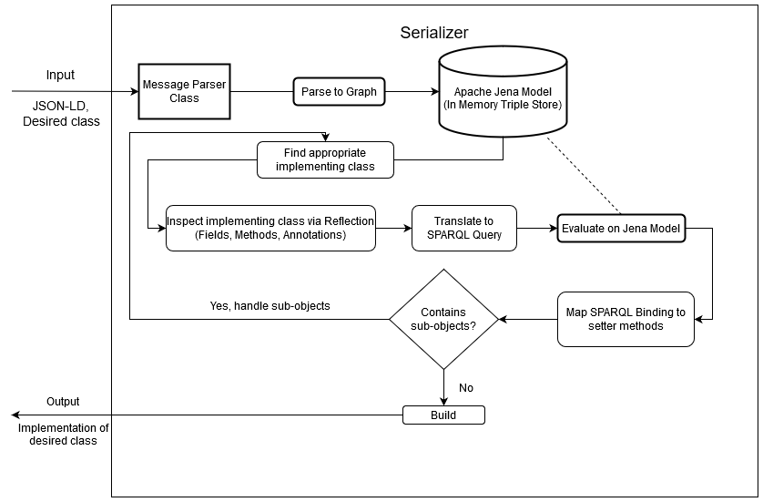

#International Data Spaces Serializer

This repository contains the IDS Serializer.
It handles serializing Java objects created by [the CodeGen tool](https://jira.iais.fraunhofer.de/stash/projects/ICTSL/repos/ids-infomodel-codegen/browse) to JSON-LD and vice versa.
For both directions, Jackson Annotations on the classes, fields and functions are of great importance.
While serializing, these annotations are used to determine the name of objects and arrays, while during parsing (deserialization) the annotations are used to find appropriate implementing classes of interfaces, determine mandatory fields, and more.
An illustration of the parsing workflow (not illustrating foreign namespace objects) is shown below.

Note that during the parsing stage, there are some implicit dependencies on certain naming conventions.
1) We parse many literals to the class TypedLiteral, which is defined in the CodeGen tool. At one point, we are forced to reference this class by name. Renaming this class requires appropriate adaptions in the parser class.
2) For each core IDS class/interface, we expect that the CodeGen tool created an implementable subclass with either identical name as the RDF class, or with an appended "Impl".
3) Some methods are also extracted by name, most notably getProperties and setProperty. Also, we expect every class to have these, as well as a URI field for the ID.
4) We expect that the setter methods set a field matching the same name with leading underscore, e.g. "setCatalog" sets a field "_catalog".

Authors and Contributors (alphabetical order): Sebastian Bader, Matthias Böckmann, Benedikt Tobias Imbusch, Christian Mader